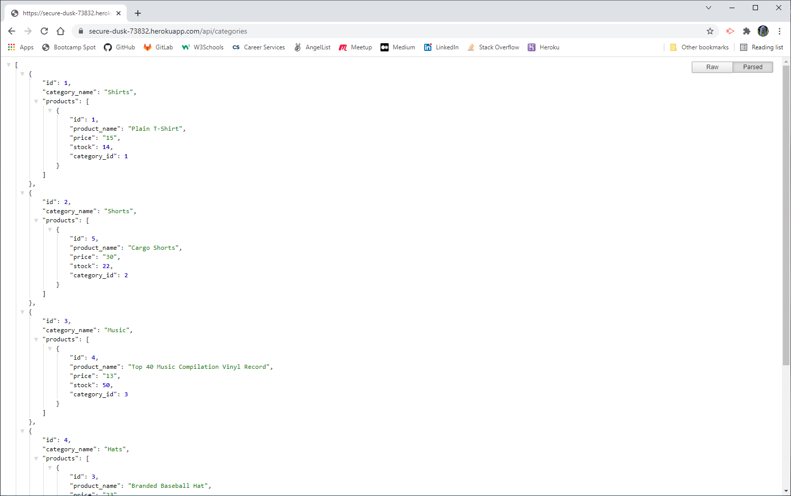

# E-Commerce Back End
## Description
This is the back end of an e-commerce site useing Express.js, MySql, and Sequelize. The site has been deployed to Heroku and the links can be found below.
## Usage
Usage Video - [https://watch.screencastify.com/v/rXcIXfPa9zuh4A34RWEe](https://watch.screencastify.com/v/rXcIXfPa9zuh4A34RWEe)  
  
View all categories - [https://secure-dusk-73832.herokuapp.com/api/categories](https://secure-dusk-73832.herokuapp.com/api/categories) 
- GET /api/categories - Shows all the categories
- GET /api/categories/`<catagory id>` - Shows the category with an id
- POST /api/categories - Creates a new category
- PUT /api/categories/`<catagory id>` - Updates a category
- DELETE /api/categories/`<catagory id>` - Deletes a category by id

View all products - [https://secure-dusk-73832.herokuapp.com/api/products](https://secure-dusk-73832.herokuapp.com/api/products)  
- GET /api/products - Shows all the products
- GET /api/products/`<catagory id>` - Shows the product with an id
- POST /api/products - Creates a new product
- PUT /api/products/`<catagory id>` - Updates a product
- DELETE /api/products/`<catagory id>` - Deletes a product by id

View all tags - [https://secure-dusk-73832.herokuapp.com/api/tags](https://secure-dusk-73832.herokuapp.com/api/tags)
- GET /api/tags - Shows all the tags
- GET /api/tags/`<catagory id>` - Shows the tag with an id
- POST /api/tags - Creates a new tag
- PUT /api/tags/`<catagory id>` - Updates a tag
- DELETE /api/tags/`<catagory id>` - Deletes a tag by id
   

 ## Credits
Zach Smith - [GitHub Profile](https://github.com/Lemelisk27)  
## Questions  
If you have any questions you can contact me directly at Lemelisk27@gmail.com. You can also find more of my work on GitHub at [Lemelisk27](https://github.com/Lemelisk27)